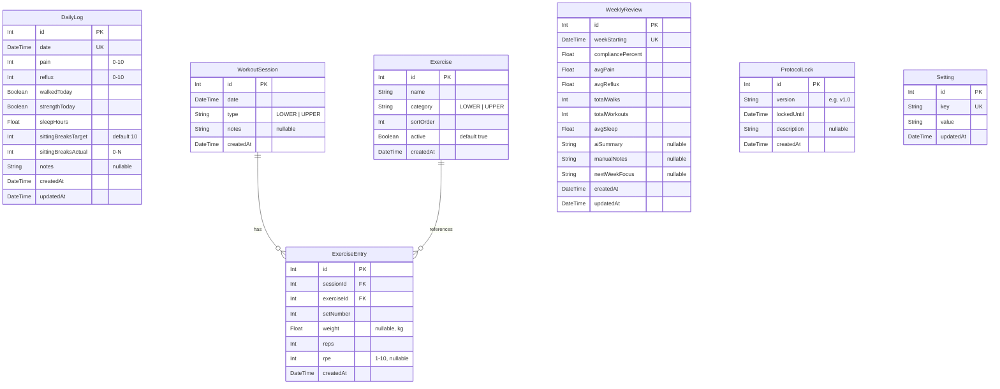

# Recovery Dashboard — Project Plan

> **Execution > Explanation**

---

## Vision

A **Personal Recovery Operating System** — not a fitness app, not a rehab app.
Desktop-first. Single user. Built to observe reality, not create theories.

Future path: `hamza.my.id/recovery` → expand to `/posture`, `/journal`, `/projects`.

---

## Tech Stack

| Layer      | Technology          | Why                                      |
|------------|---------------------|------------------------------------------|
| Framework  | Next.js 16 (App Router) | Full-stack, API routes, SSR              |
| ORM        | Prisma              | Type-safe, migration-friendly            |
| Database   | SQLite (local)      | Zero infra, single user, AI-friendly     |
| Charts     | Chart.js + react-chartjs-2 | Lightweight, flexible, well-documented |
| Styling    | Tailwind CSS v4     | Already bundled, utility-first, dark mode built-in |
| Auth       | Env-var password gate | Simple middleware check, no auth service |
| Hosting    | Local dev → Cloudflare Pages + D1 (later) | Already have Cloudflare |

---

## Design System

### Aesthetic: Notion × Linear × Obsidian

```text
├── Dark mode (default & only)
├── Clean, calm, lots of whitespace
├── Card-based layouts
├── Subtle chart colors (muted blues, greens, purples)
├── Monospace accents for data
├── Smooth micro-animations (fade, slide)
└── No bodybuilder/fitness-influencer energy
```

### Color Palette

| Token              | Value                | Usage                    |
|--------------------|----------------------|--------------------------|
| `--bg-primary`     | `#0f0f0f`            | Page background          |
| `--bg-card`        | `#1a1a1a`            | Card surfaces            |
| `--bg-card-hover`  | `#222222`            | Card hover state         |
| `--bg-input`       | `#141414`            | Input backgrounds        |
| `--border`         | `#2a2a2a`            | Borders, dividers        |
| `--border-focus`   | `#3a3a3a`            | Focus rings              |
| `--text-primary`   | `#e5e5e5`            | Primary text             |
| `--text-secondary` | `#888888`            | Secondary/muted text     |
| `--text-tertiary`  | `#555555`            | Disabled/hint text       |
| `--accent-blue`    | `#4e8cff`            | Links, primary actions   |
| `--accent-green`   | `#34d399`            | Positive/improvement     |
| `--accent-red`     | `#f87171`            | Negative/decline         |
| `--accent-amber`   | `#fbbf24`            | Warnings, caution        |
| `--accent-purple`  | `#a78bfa`            | Recovery Score accent     |

### Typography

```text
Font:       Inter (Google Fonts)
Monospace:  JetBrains Mono (data, scores, metrics)
Scale:      12 / 14 / 16 / 20 / 24 / 32 / 48px
Weight:     400 (body), 500 (labels), 600 (headings), 700 (score)
```

---

## Database Schema

### ERD



### Seed Data — Exercises

| Name                  | Category | Sort |
|-----------------------|----------|------|
| Bulgarian Split Squat | LOWER    | 1    |
| Single Leg Bridge     | LOWER    | 2    |
| Step Down             | LOWER    | 3    |
| Balance               | LOWER    | 4    |
| Calf Raise            | LOWER    | 5    |
| Dead Bug              | LOWER    | 6    |
| Rows                  | UPPER    | 1    |
| Push-Up Plus          | UPPER    | 2    |
| Carry                 | UPPER    | 3    |

### Settings Seed

| Key                       | Default Value                                          |
|---------------------------|--------------------------------------------------------|
| `recovery_score_weights`  | `{"walking":30,"strength":25,"sleep":20,"sitting":15,"checkins":10}` |
| `protocol_version`        | `v1.0`                                                 |
| `protocol_start_date`     | `2026-06-09` (today — Day 1)                           |
| `protocol_duration_days`  | `84` (12 weeks)                                        |
| `protocol_locked_until`   | `2026-07-21` (6 weeks from now)                        |
| `sitting_breaks_target`   | `10`                                                   |
| `weekly_review_day`       | `sunday`                                               |
| `workout_schedule`        | `{"mon":"LOWER","tue":"UPPER","wed":"REST","thu":"LOWER","fri":"UPPER","sat":"REST","sun":"REST"}` |

---

## Pages & Routes

### Route Map

```text
/recovery                  → Dashboard (homepage)
/recovery/checkin           → Daily Check-In form
/recovery/workout           → Workout session logger
/recovery/review            → Weekly Review page
/recovery/settings          → Settings (exercises, protocol, score formula)
/recovery/api/...           → API routes (Next.js route handlers)
```

---

## Page Specifications

### 1. Dashboard (`/recovery`)

The command center. Glanceable. No scrolling needed for key metrics.

```text
┌─────────────────────────────────────────────────────────┐
│  ┌─────────────────────────────────────────────────┐    │
│  │ 🚫  Protocol v1.0          Day 18 / 84          │    │
│  │     Locked until July 15   Weeks Remaining: 9   │    │
│  │                                                  │    │
│  │     Compliance: 83%        Execution > Explanation│   │
│  └─────────────────────────────────────────────────┘    │
├─────────────────────────────────────────────────────────┤
│                                                         │
│  ┌──────────────────────┐                               │
│  │   Recovery Score     │                               │
│  │       84/100         │   ← Big, prominent, purple    │
│  │   ████████████░░     │                               │
│  └──────────────────────┘                               │
│                                                         │
│  ┌─────────┐ ┌─────────┐ ┌─────────┐ ┌─────────┐      │
│  │ Pain    │ │ Walking │ │Strength │ │ Sleep   │      │
│  │  5/10   │ │  5/7    │ │  2/3    │ │ 7.2h    │      │
│  │ ▼ -12%  │ │ ▲ +1    │ │ ● same  │ │ ▲ +0.5  │      │
│  └─────────┘ └─────────┘ └─────────┘ └─────────┘      │
│                                                         │
│  ┌──────────┐ ┌──────────┐ ┌───────────────────┐       │
│  │Compliance│ │ Reflux   │ │ Sitting Breaks    │       │
│  │  82%     │ │  4/10    │ │ 7 / 10  (70%)     │       │
│  │ ▲ +5%    │ │ ▼ -2     │ │ ▼ -1 from avg     │       │
│  └──────────┘ └──────────┘ └───────────────────┘       │
│                                                         │
│  ┌──────────────────────────────────────────────┐       │
│  │  7d / 30d / 90d   Pain & Walking Trend       │       │
│  │  ▁▂▃▅▆▅▃ ────────────────────────             │       │
│  └──────────────────────────────────────────────┘       │
│                                                         │
│  ┌──────────────────────────────────────────────┐       │
│  │  Compliance Trend (bar chart)                 │       │
│  │  █ █ █ ▓ █ █ ▓ █                              │       │
│  └──────────────────────────────────────────────┘       │
│                                                         │
│  [Quick Check-In →]  [Log Workout →]                    │
└─────────────────────────────────────────────────────────┘
```

**Execution Banner data:**
- Protocol version + lock date from `ProtocolLock` table
- Day count: days since `protocol_start_date` setting / 84 (12 weeks)
- Weeks remaining: computed from day count
- Compliance %: (days with check-in / total days elapsed) × 100

**Data sources:**
- Metric cards: Latest DailyLog + computed aggregates
- Sitting Breaks: `sittingBreaksActual / sittingBreaksTarget` from DailyLog
- Trends: DailyLog grouped by period
- Recovery Score: Computed from weighted formula in Settings

---

### 2. Daily Check-In (`/recovery/checkin`)

< 30 seconds to complete. No friction.

```text
┌─────────────────────────────────────────┐
│  Daily Check-In — June 9, 2026          │
├─────────────────────────────────────────┤
│                                         │
│  Pain (0–10)          [●●●●●○○○○○] 5    │  ← Slider
│                                         │
│  Reflux (0–10)        [●●●●○○○○○○] 4    │  ← Slider
│                                         │
│  Walk completed?      [✓ Yes] [ No]     │  ← Toggle
│                                         │
│  Strength completed?  [ Yes] [✓ No]     │  ← Toggle
│                                         │
│  Sleep (hours)        [  7.5  ]         │  ← Number input
│                                         │
│  Sitting Breaks       [  7  ] / 10      │  ← Number input
│  (how many did you take today?)         │     (target shown)
│                                         │
│  Notes (optional)                       │
│  ┌─────────────────────────────────┐    │
│  │ Neck felt better today.         │    │
│  └─────────────────────────────────┘    │
│                                         │
│  [Save Check-In]                        │
│                                         │
│  ── Previous 3 Days ──                  │
│  Jun 8: Pain 6 · Sleep 7h · Breaks 8/10│
│  Jun 7: Pain 5 · Sleep 8h · Breaks 7/10│
│  Jun 6: Pain 7 · Sleep 6h · Breaks 5/10│
└─────────────────────────────────────────┘
```

**Behavior:**
- If today's check-in exists → show as editable (update mode)
- If not → fresh form
- Auto-save not needed, explicit save button
- Show last 3 days for context below the form

---

### 3. Workout Logger (`/recovery/workout`)

```text
┌──────────────────────────────────────────────────┐
│  Workout — June 9, 2026                          │
│  [Lower Day ▼]   ← Dropdown: Lower / Upper       │
├──────────────────────────────────────────────────┤
│                                                  │
│  ┌──────────────────────────────────────────┐    │
│  │ Bulgarian Split Squat                     │    │
│  │                                           │    │
│  │  Set  │ Weight (kg) │ Reps │ RPE          │    │
│  │  ─────┼─────────────┼──────┼─────         │    │
│  │  1    │  [20]       │ [12] │ [7]          │    │
│  │  2    │  [20]       │ [10] │ [8]          │    │
│  │  3    │  [20]       │ [8]  │ [9]          │    │
│  │  [+ Add Set]                              │    │
│  │                                           │    │
│  │  Last session: 20kg × 12,10,8 @ RPE 7,8,9│    │
│  └──────────────────────────────────────────┘    │
│                                                  │
│  ┌──────────────────────────────────────────┐    │
│  │ Single Leg Bridge                         │    │
│  │  Set  │ Weight │ Reps │ RPE              │    │
│  │  ...                                      │    │
│  └──────────────────────────────────────────┘    │
│                                                  │
│  ... (remaining exercises)                        │
│                                                  │
│  Session Notes                                   │
│  ┌──────────────────────────────────────┐        │
│  │                                      │        │
│  └──────────────────────────────────────┘        │
│                                                  │
│  [Save Workout]                                  │
└──────────────────────────────────────────────────┘
```

**Behavior:**
- Pre-populates exercises based on selected type (LOWER/UPPER)
- Shows last session data for each exercise (weight/reps/RPE) as reference
- Default 3 sets per exercise, expandable
- Inline "last session" reference below each exercise card
- Only shows active exercises

---

### 4. Weekly Review (`/recovery/review`)

The most important page.

```text
┌──────────────────────────────────────────────────────┐
│  Weekly Review — Week of June 2–8, 2026              │
│  [← Prev Week]                     [Next Week →]     │
├──────────────────────────────────────────────────────┤
│                                                      │
│  ── Auto-Generated Summary ──                        │
│                                                      │
│  ┌────────────────────────────────────────────┐      │
│  │ 📊 This Week                               │      │
│  │                                            │      │
│  │  Avg Pain:      5.2  (▼ -0.8 from last wk) │      │
│  │  Avg Reflux:    3.8  (▼ -0.5)              │      │
│  │  Walks:         5/7  (▲ +1)                │      │
│  │  Workouts:      3/3  (● same)              │      │
│  │  Avg Sleep:     7.4h (▲ +0.3)             │      │
│  │  Compliance:    88%  (▲ +6%)               │      │
│  │  Recovery Score: 84  (▲ +3)                │      │
│  └────────────────────────────────────────────┘      │
│                                                      │
│  ┌────────────────────────────────────────────┐      │
│  │  Pain vs Walking (7-day line chart)         │      │
│  │  ▁▂▃▅▆▅▃                                    │      │
│  └────────────────────────────────────────────┘      │
│                                                      │
│  ── Your Notes ──                                    │
│                                                      │
│  What improved?                                      │
│  ┌────────────────────────────────────────────┐      │
│  │ Neck pain noticeably better after Day 4.    │      │
│  └────────────────────────────────────────────┘      │
│                                                      │
│  What worsened?                                      │
│  ┌────────────────────────────────────────────┐      │
│  │ Reflux worse on days I ate late.            │      │
│  └────────────────────────────────────────────┘      │
│                                                      │
│  Next week's focus                                   │
│  ┌────────────────────────────────────────────┐      │
│  │ Don't eat past 8pm. Keep walking streak.    │      │
│  └────────────────────────────────────────────┘      │
│                                                      │
│  [Save Review]                                       │
└──────────────────────────────────────────────────────┘
```

**Behavior:**
- Auto-computes stats from DailyLog data for the selected week
- Compares to previous week (delta arrows)
- Manual text fields for reflections (what improved, what worsened, next focus)
- Navigate between weeks
- Auto-save or explicit save

---

### 5. Settings (`/recovery/settings`)

```text
┌──────────────────────────────────────────────────────┐
│  Settings                                            │
├──────────────────────────────────────────────────────┤
│                                                      │
│  ── Protocol Lock ──                                 │
│  Version:       [v1.0]                               │
│  Locked Until:  [2026-07-15]                         │
│  [Update Lock]                                       │
│                                                      │
│  ── Exercises ──                                     │
│  Lower Day:                                          │
│  ☑ Bulgarian Split Squat  [↑ ↓ ✎ 🗑]                │
│  ☑ Single Leg Bridge      [↑ ↓ ✎ 🗑]                │
│  ☑ Step Down              [↑ ↓ ✎ 🗑]                │
│  ...                                                 │
│  [+ Add Exercise]                                    │
│                                                      │
│  Upper Day:                                          │
│  ☑ Rows                   [↑ ↓ ✎ 🗑]                │
│  ☑ Push-Up Plus            [↑ ↓ ✎ 🗑]                │
│  ☑ Carry                  [↑ ↓ ✎ 🗑]                │
│  [+ Add Exercise]                                    │
│                                                      │
│  ── Recovery Score Weights ──                        │
│  Walking:        [30] %                              │
│  Strength:       [25] %                              │
│  Sleep:          [20] %                              │
│  Sitting Breaks: [15] %                              │
│  Check-ins:      [10] %                              │
│  Total: 100% ✓                                       │
│                                                      │
│  ── Workout Schedule ──                              │
│  Mon: [Lower ▼]                                      │
│  Tue: [Upper ▼]                                      │
│  Wed: [Rest  ▼]                                      │
│  ...                                                 │
│                                                      │
│  ── Data Export ──                                   │
│  [Export JSON]  [Export CSV]                          │
│                                                      │
└──────────────────────────────────────────────────────┘
```

---

## API Routes

```text
POST   /recovery/api/checkin          Create/update daily log
GET    /recovery/api/checkin          Get logs (query: ?days=7|30|90)
GET    /recovery/api/checkin/[date]   Get single day's log

POST   /recovery/api/workout          Save workout session + entries
GET    /recovery/api/workout          Get sessions (query: ?days=30)
GET    /recovery/api/workout/[id]     Get single session with entries

GET    /recovery/api/review/[week]    Get/compute weekly review data
POST   /recovery/api/review           Save weekly review notes

GET    /recovery/api/exercises        List exercises
POST   /recovery/api/exercises        Create exercise
PUT    /recovery/api/exercises/[id]   Update exercise
DELETE /recovery/api/exercises/[id]   Soft-delete (set active=false)

GET    /recovery/api/settings         Get all settings
PUT    /recovery/api/settings/[key]   Update setting

GET    /recovery/api/dashboard        Aggregated dashboard data
GET    /recovery/api/export/json      Export all data as JSON
GET    /recovery/api/export/csv       Export all data as CSV
```

---

## Recovery Score Computation

```javascript
function computeRecoveryScore(weekData, weights) {
  // Walking: days walked / 7 * 100
  const walkScore = (weekData.totalWalks / 7) * 100;

  // Strength: sessions completed / expected * 100
  const strengthScore = (weekData.totalWorkouts / weekData.expectedWorkouts) * 100;

  // Sleep: clamp(avgSleep / 8 * 100, 0, 100)
  const sleepScore = Math.min((weekData.avgSleep / 8) * 100, 100);

  // Sitting breaks: based on check-in compliance (proxy)
  const sittingScore = weekData.sittingCompliance * 100;

  // Check-ins: days checked in / 7 * 100
  const checkinScore = (weekData.daysCheckedIn / 7) * 100;

  return Math.round(
    (walkScore * weights.walking +
     strengthScore * weights.strength +
     sleepScore * weights.sleep +
     sittingScore * weights.sitting +
     checkinScore * weights.checkins) / 100
  );
}
```

---

## File Structure

```text
recovery_dashboard/
├── prisma/
│   ├── schema.prisma
│   ├── seed.ts
│   └── dev.db                    (gitignored)
├── src/
│   ├── app/
│   │   ├── recovery/
│   │   │   ├── layout.tsx        (sidebar nav + protocol banner)
│   │   │   ├── page.tsx          (Dashboard)
│   │   │   ├── checkin/
│   │   │   │   └── page.tsx      (Daily Check-In)
│   │   │   ├── workout/
│   │   │   │   └── page.tsx      (Workout Logger)
│   │   │   ├── review/
│   │   │   │   └── page.tsx      (Weekly Review)
│   │   │   ├── settings/
│   │   │   │   └── page.tsx      (Settings)
│   │   │   └── api/
│   │   │       ├── checkin/
│   │   │       │   └── route.ts
│   │   │       ├── workout/
│   │   │       │   └── route.ts
│   │   │       ├── review/
│   │   │       │   └── route.ts
│   │   │       ├── exercises/
│   │   │       │   └── route.ts
│   │   │       ├── settings/
│   │   │       │   └── route.ts
│   │   │       ├── dashboard/
│   │   │       │   └── route.ts
│   │   │       └── export/
│   │   │           └── route.ts
│   │   ├── layout.tsx            (root layout)
│   │   ├── page.tsx              (redirect → /recovery)
│   │   └── globals.css           (design system)
│   ├── components/
│   │   ├── ui/
│   │   │   ├── Card.tsx
│   │   │   ├── Slider.tsx
│   │   │   ├── Toggle.tsx
│   │   │   ├── Button.tsx
│   │   │   ├── Input.tsx
│   │   │   ├── Badge.tsx
│   │   │   └── Select.tsx
│   │   ├── charts/
│   │   │   ├── TrendChart.tsx
│   │   │   ├── ComplianceBar.tsx
│   │   │   └── ScoreGauge.tsx
│   │   ├── ProtocolBanner.tsx
│   │   ├── RecoveryScore.tsx
│   │   ├── MetricCard.tsx
│   │   ├── ExerciseCard.tsx
│   │   ├── CheckInForm.tsx
│   │   ├── WorkoutForm.tsx
│   │   ├── WeeklyReviewPanel.tsx
│   │   └── Sidebar.tsx
│   ├── lib/
│   │   ├── prisma.ts             (Prisma client singleton)
│   │   ├── score.ts              (Recovery Score computation)
│   │   ├── aggregations.ts       (Dashboard data aggregation)
│   │   ├── export.ts             (JSON/CSV export logic)
│   │   └── auth.ts               (Simple password middleware)
│   └── styles/
│       └── (component-specific CSS modules if needed)
├── .env                          (AUTH_PASSWORD, DATABASE_URL)
├── .gitignore
├── next.config.ts
├── package.json
├── tsconfig.json
└── README.md
```

---

## Build Phases

### Phase 1 — Foundation (Session 1)

> [!IMPORTANT]
> Get the project running with data flowing before touching UI polish.

1. Initialize Next.js project
2. Set up Prisma + SQLite schema
3. Run migrations + seed exercises
4. Create Prisma client singleton
5. Set up `globals.css` design system (colors, typography, spacing)
6. Build root layout + `/recovery` layout with sidebar navigation
7. Add protocol banner component
8. Set up simple password middleware

**Deliverable:** App runs, DB has seed data, navigation works, dark theme active.

---

### Phase 2 — Daily Check-In (Session 2)

1. Build Check-In API route (POST/GET)
2. Build slider, toggle, input UI components
3. Build CheckInForm component
4. Build check-in page with form + previous 3 days
5. Test create + edit flows

**Deliverable:** Can submit and edit daily check-ins. Data persists.

---

### Phase 3 — Workout Logger (Session 3)

1. Build Workout API routes
2. Build ExerciseCard component (sets/reps/weight/RPE)
3. Build WorkoutForm with dynamic set management
4. Build workout page with Lower/Upper toggle
5. Show last session reference data

**Deliverable:** Can log full workout sessions. Exercises editable.

---

### Phase 4 — Dashboard (Session 4)

1. Build Dashboard API route (aggregations)
2. Build MetricCard component
3. Build RecoveryScore component (big circular/bar display)
4. Set up Chart.js + build TrendChart + ComplianceBar
5. Build dashboard page with all metrics + trend graphs
6. Add 7d / 30d / 90d toggle for charts

**Deliverable:** Dashboard shows live metrics, trends, recovery score.

---

### Phase 5 — Weekly Review (Session 5)

1. Build Review API routes (auto-compute + save notes)
2. Build WeeklyReviewPanel component
3. Build review page with auto-stats + manual text areas
4. Add week navigation (prev/next)
5. Add delta comparisons (▲ ▼ ●)

**Deliverable:** Weekly review with auto-generated stats and manual notes.

---

### Phase 6 — Settings + Export (Session 6)

1. Build Settings API routes
2. Build settings page (exercises CRUD, score weights, schedule, protocol lock)
3. Build export endpoints (JSON + CSV)
4. Polish transitions, animations, hover states
5. Test full flow end-to-end

**Deliverable:** Fully functional MVP. All pages working. Data exportable.

---

## Key Principles

> [!CAUTION]
> Read these before every session.

| #  | Principle                                           |
|----|-----------------------------------------------------|
| 1  | **< 30 seconds** for daily check-in                |
| 2  | **5 metrics only**: Pain, Walking, Compliance, Strength, Reflux |
| 3  | **No symptom encyclopedia** — no neck/trap/scapula tracking    |
| 4  | **No PRI tracking** — no pelvic rotation, shoulder height     |
| 5  | **Protocol lock** prevents redesigning the system weekly      |
| 6  | **Observe reality**, don't create theories                    |
| 7  | Desktop-first, mobile-responsive                              |
| 8  | Single user, no auth complexity                               |

---

## Not Building (Explicitly)

- ❌ User signup / login / teams
- ❌ Symptom encyclopedia
- ❌ PRI / postural tracking
- ❌ 50 metrics (only 5)
- ❌ Social features
- ❌ AI coaching / recommendations
- ❌ Exercise video library
- ❌ Meal / nutrition tracking
- ❌ Mobile app (responsive web is enough)
